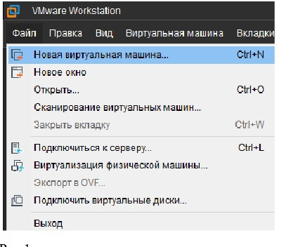
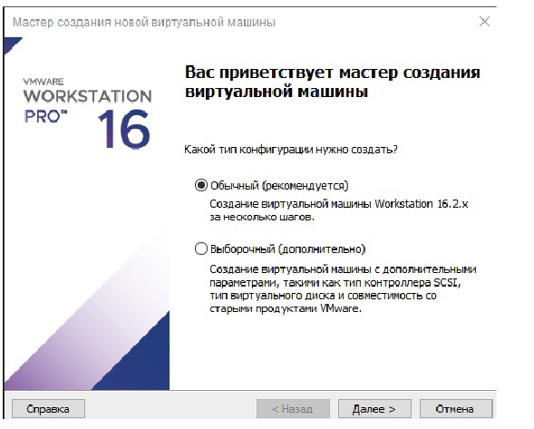
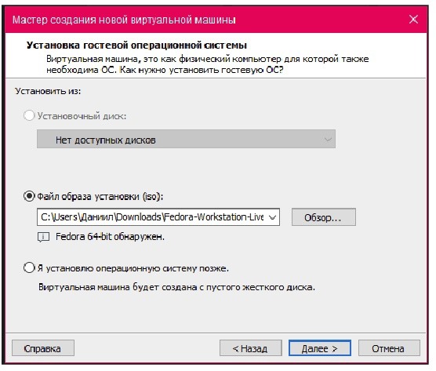
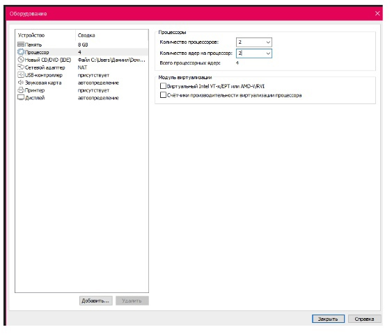
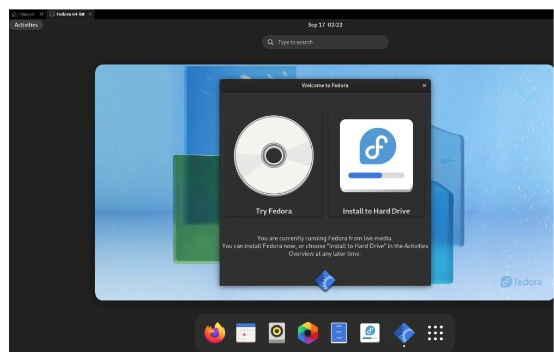
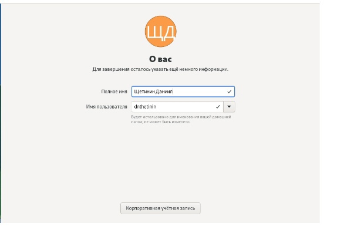
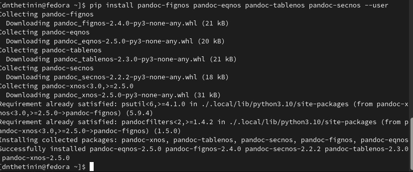

---
## Front matter
lang: ru-RU
title: Лабораторная работа 1 
author:
  - Щетинин Даниил Николаевич
institute:
  - Российский университет дружбы народов, Москва, Россия
 
date: 17.02.2023

## i18n babel
babel-lang: russian
babel-otherlangs: english

## Formatting pdf
toc: false
toc-title: Содержание
slide_level: 2
aspectratio: 169
section-titles: true
theme: metropolis
header-includes:
 - \metroset{progressbar=frametitle,sectionpage=progressbar,numbering=fraction}
 - '\makeatletter'
 - '\beamer@ignorenonframefalse'
 - '\makeatother'
---

# Вводная часть

## Цель работы

   Целью данной работы является приобретение практических навыков установки операционной системы на виртуальную машину, настройки минимально необходимых для дальнейшей работы сервисов.

## Задание

  По инструкции установить виртуальную машину на свой компьютер и запустить на ней дистрибутив линукс (в данном случае федора)
   

## Шаг 1 

После установки программы для создания виртуальной машины, требуется скачать образ диска дистрибутива Линукс

Выбираем опцию “Новая виртуальная машина” в приложении для создания виртуальной машины (vmware в данном случае)

## Шаг 2 

Проведём базовую настройку git: 
Зададим имя и email владельца репозитория, Настроим utf-8 в выводе сообщений git и прочее

{#fig:001 width=70%}

## Шаг 3

Открывается мастер создания новой виртуальной машины

{#fig:002 width=70%}

Выбираем скачанный файл образа установки

## Шаг 4 

{#fig:003 width=70%}

## Шаг 5 

В мастере создания новой виртуальной машины ставим желаемые настройки
(Выделенная память на жёстком диске, выделенные ядра процессора и.т.д.)

{#fig:004 width=70%}

## Шаг 6

После завершения настройки создания виртуальной машины автоматически
запустится установщик Fedora
Выбираем опцию “Install to hard drive”

{#fig:005 width=70%}

## Шаг 7 

После перезагрузки виртуальной машины устанавливаем желаемое имя
пользователя и завершаем установку

{#fig:006 width=70%}

## Шаг 8

После этого требуется установить TeX, texlive и pandoc, и некоторые расширения

с помощью команды dnf install, pip install. Для этого требуются root-права.

{#fig:009 width=70%}

## Конец

Спасибо за внимание! 

