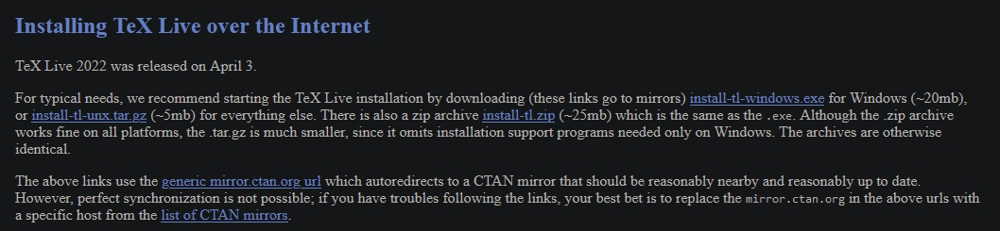

---
## Front matter
title: "Лабораторная работа 1"
author: "Щетинин Даниил Николаевич"

## Generic otions
lang: ru-RU
toc-title: "Содержание"

## Bibliography
bibliography: bib/cite.bib
csl: pandoc/csl/gost-r-7-0-5-2008-numeric.csl

## Pdf output format
toc: true # Table of contents
toc-depth: 2
lof: true # List of figures
lot: true # List of tables
fontsize: 12pt
linestretch: 1.5
papersize: a4
documentclass: scrreprt
## I18n polyglossia
polyglossia-lang:
  name: russian
  options:
	- spelling=modern
	- babelshorthands=true
polyglossia-otherlangs:
  name: english
## I18n babel
babel-lang: russian
babel-otherlangs: english
## Fonts
mainfont: PT Serif
romanfont: PT Serif
sansfont: PT Sans
monofont: PT Mono
mainfontoptions: Ligatures=TeX
romanfontoptions: Ligatures=TeX
sansfontoptions: Ligatures=TeX,Scale=MatchLowercase
monofontoptions: Scale=MatchLowercase,Scale=0.9
## Biblatex
biblatex: true
biblio-style: "gost-numeric"
biblatexoptions:
  - parentracker=true
  - backend=biber
  - hyperref=auto
  - language=auto
  - autolang=other*
  - citestyle=gost-numeric
## Pandoc-crossref LaTeX customization
figureTitle: "Рис."
tableTitle: "Таблица"
listingTitle: "Листинг"
lofTitle: "Список иллюстраций"
lotTitle: "Список таблиц"
lolTitle: "Листинги"
## Misc options
indent: true
header-includes:
  - \usepackage{indentfirst}
  - \usepackage{float} # keep figures where there are in the text
  - \floatplacement{figure}{H} # keep figures where there are in the text
---

# Цель работы

Целью данной работы является приобретение практических навыков установки операционной системы на виртуальную машину, настройки минимально необходимых для дальнейшей работы сервисов.

# Задание

   По инструкции установить виртуальную машину на свой компьютер и запустить на ней дистрибутив линукс (в данном случае федора)
   
# Выполнение лабораторной работы

После установки программы для создания виртуальной машины, требуется скачать образ диска дистрибутива Линукс, в данной работе будет использоваться 64-битный образ Fedora, скачанный с
https://getfedora.org/ru/workstation/download


Выбираем опцию “Новая виртуальная машина” в приложении для создания виртуальной машины (vmware в данном случае)

(рис. @fig:001).

{#fig:001 width=70%}

Открывается мастер создания новой виртуальной машины

(рис. @fig:002).

{#fig:002 width=70%}

Выбираем скачанный файл образа установки

(рис. @fig:003).

{#fig:003 width=70%}

В мастере создания новой виртуальной машины ставим желаемые настройки
(Выделенная память на жёстком диске, выделенные ядра процессора и.т.д.)

(рис. @fig:004).

{#fig:004 width=70%}

После завершения настройки создания виртуальной машины автоматически
запустится установщик Fedora
Выбираем опцию “Install to hard drive”

(рис. @fig:005).

{#fig:005 width=70%}

После перезагрузки виртуальной машины устанавливаем желаемое имя
пользователя и завершаем установку

(рис. @fig:006).

{#fig:006 width=70%}


(рис. @fig:007).

{#fig:007 width=70%}

(рис. @fig:008).

{#fig:008 width=70%}


После этого требуется установить TeX, texlive и pandoc, и некоторые расширения

с помощью команды dnf install, pip install. Для этого требуются root-права.

(рис. @fig:009).

{#fig:009 width=70%}


# Домашнее задание
с помощью команды 
```
 dmesg | grep -i "-"
 
```

ищем нужную информацию, а именно:


    Версия ядра Linux (Linux version).
    
```
    inux version 5.19.16-200.fc36.x86_64 (mockbuild@bkernel01.iad2.fedoraproject.org) 
    (gcc (GCC) 12.2.1 20220819 (Red Hat 12.2.1-2), GNU ld version 
```
    
    Частота процессора (Detected Mhz processor).
    
```
        0.000014] tsc: Detected 3194.005 MHz processor
```
    
    Модель процессора (CPU0).
    
```
    AMD Ryzen 7 PRO 2700 Eight-Core Processor
```

    
    Объём доступной оперативной памяти (Memory available).
    
```
Maximum display memory size is 262144 kiB
```

262144 Кбайт озу

    Тип обнаруженного гипервизора (Hypervisor detected).
    
```
    [    0.000000] Hypervisor detected: VMware
```
    = Гипервизор Vmware 
    
    Тип файловой системы корневого раздела.
    
```
EXT4
```

    
    Последовательность монтирования файловых систем.
    
        
```
EXT4
```


Пример выполнения команды для поиска информации:

(рис. @fig:010.

{#fig:010 width=70%}

# Контрольные вопросы 
1

Учётная запись пользователя содержит:
- Имя пользователя (user name)
- Идентификационный номер пользователя (UID)
- Идентификационный номер группы (GID).
- Пароль (password)
- Полное имя (full name)
- Домашний каталог (home directory)
- Начальную оболочку (login shell

2

Для получения справки по команде:
man [команда]. Например, команда «man ls» выведет справку о
команде «ls».
- Для перемещения по файловой системе:
cd [путь]. Например, команда «cd newdir» осуществляет переход в
каталог newdir
- Для просмотра содержимого каталога:
ls [опции] [путь]. Например, команда «ls –a ~/newdir» отобразит
имена скрытых файлов в каталоге newdir
- Для определения объёма каталога:
du [опция] [путь]. Например, команда «du –k ~/newdir» выведет
размер каталога newdir в килобайтах
- Для создания / удаления каталогов / файлов:
mkdir [опции] [путь] / rmdir [опции] [путь] / rm [опции] [путь].
Например, команда «mkdir –p ~/newdir1/newdir2» создаст
иерархическую цепочку подкаталогов, создав каталоги newdir1 и
newdir2; команда «rmdir -v ~/newdir» удалит каталог newdir;
команда «rm –r ~/newdir» так же удалит каталог newdir
- Для задания определённых прав на файл / каталог:
сhmod [опции] [путь]. Например, команда «сhmod g+r ~/text.txt»
даст группе право на чтение файла text.txt
- Для просмотра истории команд:
history [опции]. Например, команда «history 5» покажет список
последних 5 команд

3

Файловая система имеет два значения: с одной стороны – это
архитектура хранения битов на жестком диске, с другой – это
организация каталогов в соответствии с идеологией Unix.
Файловая система (англ. «file system») – это архитектура хранения
данных в системе, хранение данных в оперативной памяти и доступа к
конфигурации ядра. Файловая система устанавливает физическую и
логическую структуру файлов, правила их создания и управления ими.
В физическом смысле файловая система Linux представляет собой
пространство раздела диска, разбитое на блоки фиксированного
размера. Их размер кратен размеру сектора: 1024, 2048, 4096 или 8120
байт.

4

Команда «findmnt» или «findmnt --all» будет отображать все
подмонтированные файловые системы или искать файловую систему.

5

С помощью команд с префиксом sig, т.е sigint sigquit sighup sigterm sigkill

# Выводы

Я успешно установил виртуальную машину на свой компьютер и смог ей воспользоваться 

