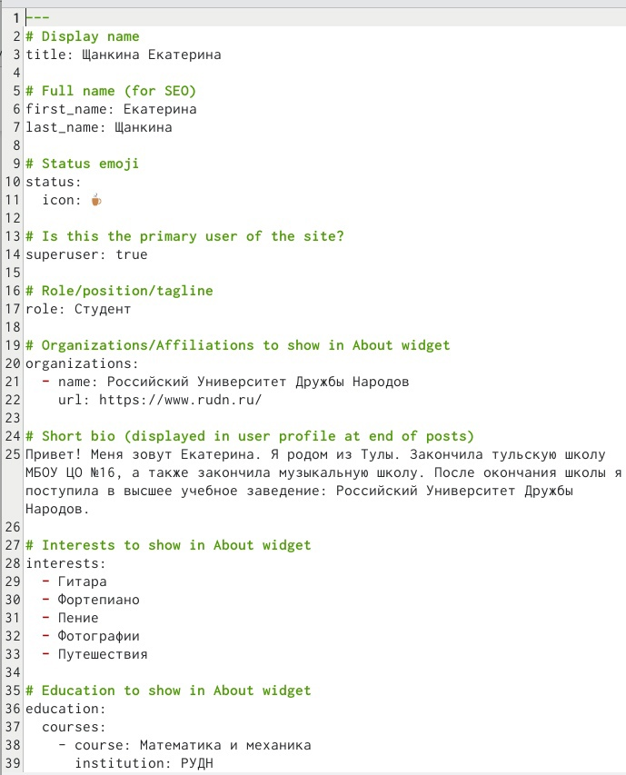
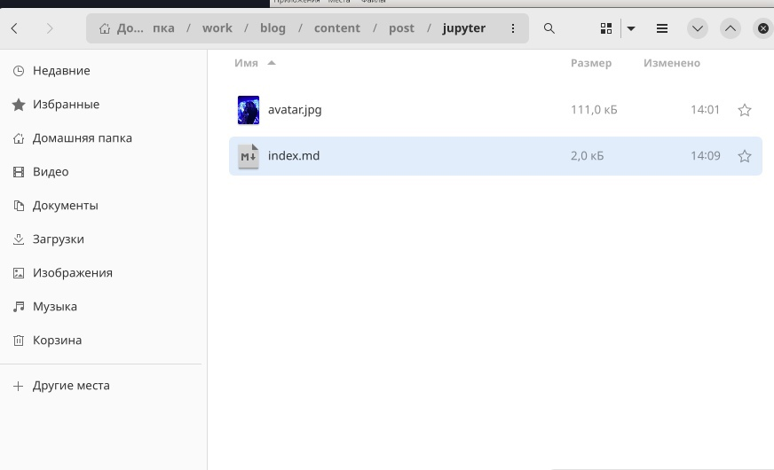

---
## Front matter
lang: ru-RU
title: Лабораторная работа 2 
author:
  - Екатерина Щанкина
institute:
  - Российский университет дружбы народов, Москва, Россия
 
date: 17.02.2023

## i18n babel
babel-lang: russian
babel-otherlangs: english

## Formatting pdf
toc: false
toc-title: Содержание
slide_level: 2
aspectratio: 169
section-titles: true
theme: metropolis
header-includes:
 - \metroset{progressbar=frametitle,sectionpage=progressbar,numbering=fraction}
 - '\makeatletter'
 - '\beamer@ignorenonframefalse'
 - '\makeatother'
---

# Вводная часть

## Цель работы

   Цель работы: Добавить к сайту данные о себе.
    

## Задание

::: incremental

 Разместить фотографию владельца сайта.
• Разместить краткое описание владельца сайта (Biography)
• Добавить информацию об интересах (Interests).
• Добавить информацию от образовании (Education).
• Сделать пост по прошедшей неделе.
• Добавить пост на тему по выбору:
• Управление версиями. Git.
• Непрерывная интеграция и непрерывное развертывание (CI/CD).

:::

## Шаг 1 

1. Для размещения фотографии заходим в “authors” -> “admin” и добавляем
фотографию. (рис. -fig: 001)

{#fig:001 width=70%} 

## Шаг 2 

2.Добавим краткое описание владельца сайта, информацию о интересах, образовании. В этой же папке открывает файл “md” и изменяем информацию.
Для добавления боиграфии переходим в самый низ!!
{#fig:002 width=70%}
{#fig:003 width=70%}

## Шаг 3

3. Далее добавим пост недели и пост по выбору. Переходим в папку “contents”
-> “post” и добавляем необходимую информацию.

{#fig:004 width=70%}

## Шаг 4 

{#fig:005 width=70%}

## Шаг 5 

{#fig:006 width=70%}

## Шаг 6

{#fig:007 width=70%}

## Шаг 7 

{#fig:008 width=70%}

## Шаг 8 

{#fig:009 width=70%}

## Шаг 9 

{#fig:010 width=70%}

## Шаг 10

{#fig:011 width=70%}

## Шаг 12 

{#fig:012 width=70%}

## Конец

Спасибо за внимание! 

