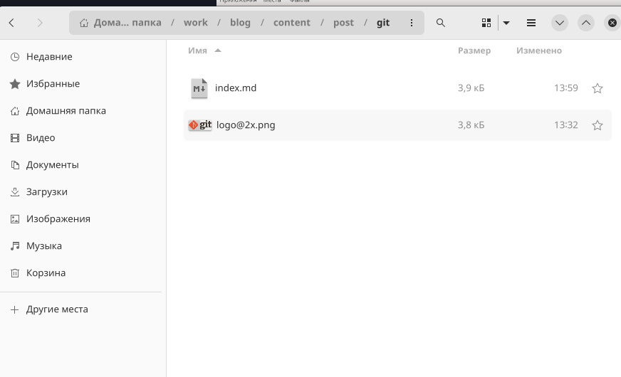
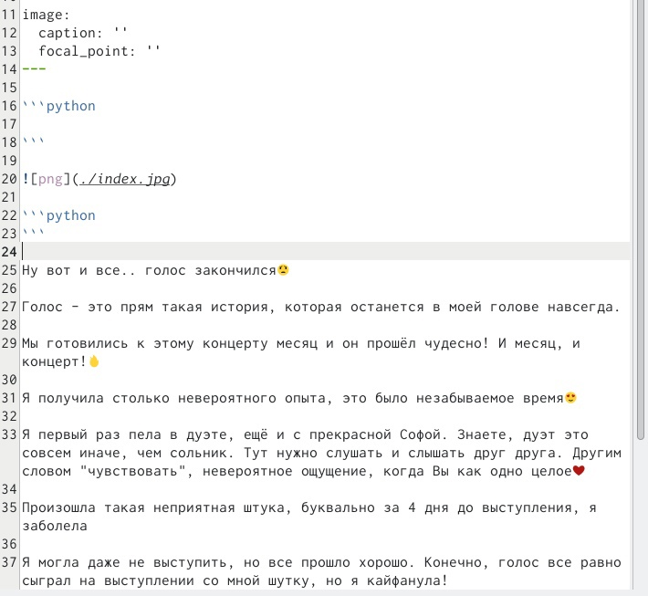

---
## Front matter
title: "Проект"
author: "Екатерина Щанкина"

## Generic otions
lang: ru-RU
toc-title: "Содержание"

## Bibliography
bibliography: bib/cite.bib
csl: pandoc/csl/gost-r-7-0-5-2008-numeric.csl

## Pdf output format
toc: true # Table of contents
toc-depth: 2
lof: true # List of figures
lot: true # List of tables
fontsize: 12pt
linestretch: 1.5
papersize: a4
documentclass: scrreprt
## I18n polyglossia
polyglossia-lang:
  name: russian
  options:
	- spelling=modern
	- babelshorthands=true
polyglossia-otherlangs:
  name: english
## I18n babel
babel-lang: russian
babel-otherlangs: english
## Fonts
mainfont: PT Serif
romanfont: PT Serif
sansfont: PT Sans
monofont: PT Mono
mainfontoptions: Ligatures=TeX
romanfontoptions: Ligatures=TeX
sansfontoptions: Ligatures=TeX,Scale=MatchLowercase
monofontoptions: Scale=MatchLowercase,Scale=0.9
## Biblatex
biblatex: true
biblio-style: "gost-numeric"
biblatexoptions:
  - parentracker=true
  - backend=biber
  - hyperref=auto
  - language=auto
  - autolang=other*
  - citestyle=gost-numeric
## Pandoc-crossref LaTeX customization
figureTitle: "Рис."
tableTitle: "Таблица"
listingTitle: "Листинг"
lofTitle: "Список иллюстраций"
lotTitle: "Список таблиц"
lolTitle: "Листинги"
## Misc options
indent: true
header-includes:
  - \usepackage{indentfirst}
  - \usepackage{float} # keep figures where there are in the text
  - \floatplacement{figure}{H} # keep figures where there are in the text
---

## Цель работы

   Цель работы: Добавить к сайту данные о себе.
    

## Задание

::: incremental

 Разместить фотографию владельца сайта.
• Разместить краткое описание владельца сайта (Biography)
• Добавить информацию об интересах (Interests).
• Добавить информацию от образовании (Education).
• Сделать пост по прошедшей неделе.
• Добавить пост на тему по выбору:
• Управление версиями. Git.
• Непрерывная интеграция и непрерывное развертывание (CI/CD).

:::

## Шаг 1 

1. Для размещения фотографии заходим в “authors” -> “admin” и добавляем
фотографию. (рис. -fig: 001)

{#fig:001 width=70%} 

## Шаг 2 

2.Добавим краткое описание владельца сайта, информацию о интересах, образовании. В этой же папке открывает файл “md” и изменяем информацию.
Для добавления боиграфии переходим в самый низ!!
{#fig:002 width=70%}
{#fig:003 width=70%}

## Шаг 3

3. Далее добавим пост недели и пост по выбору. Переходим в папку “contents”
-> “post” и добавляем необходимую информацию.

{#fig:004 width=70%}

## Шаг 4 

{#fig:005 width=70%}

## Шаг 5 

{#fig:006 width=70%}

## Шаг 6

{#fig:007 width=70%}

## Шаг 7 

{#fig:008 width=70%}

## Шаг 8 

{#fig:009 width=70%}

## Шаг 9 

{#fig:010 width=70%}

## Шаг 10

{#fig:011 width=70%}

## Шаг 12 

{#fig:012 width=70%}

## Конец

Спасибо за внимание! 

