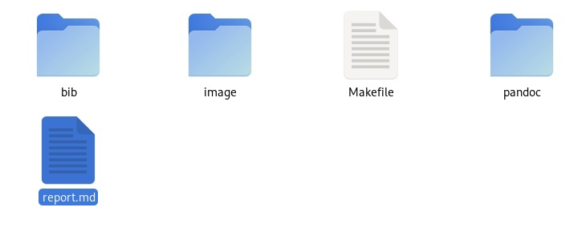
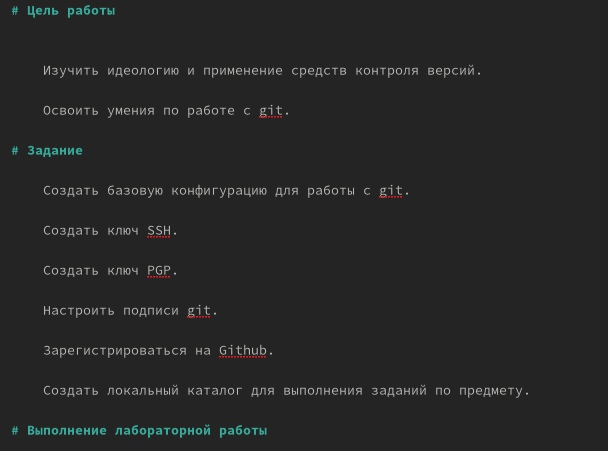
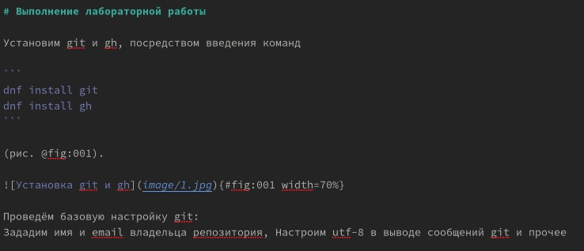
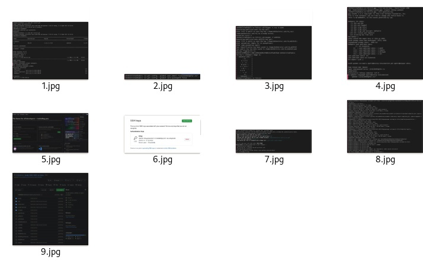
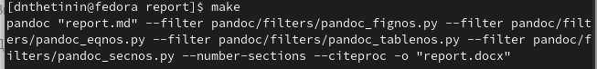

---
## Front matter
lang: ru-RU
title: Лабораторная работа 3 
author:
  - Щетинин Даниил Николаевич
institute:
  - Российский университет дружбы народов, Москва, Россия
 
date: 17.02.2023

## i18n babel
babel-lang: russian
babel-otherlangs: english

## Formatting pdf
toc: false
toc-title: Содержание
slide_level: 2
aspectratio: 169
section-titles: true
theme: metropolis
header-includes:
 - \metroset{progressbar=frametitle,sectionpage=progressbar,numbering=fraction}
 - '\makeatletter'
 - '\beamer@ignorenonframefalse'
 - '\makeatother'
---

# Вводная часть

## Цель работы

   -     Научиться оформлять отчёты с помощью легковесного языка разметки Markdown.
    

## Задание

  - Создать отчёт по предыдущей лабораторной работе в формате Markdown.

## Шаг 1 

Для создания отчета о нашей работе нужно начать с шаблона, предоставленного в папке report нашего репозитория

{#fig:001 width=70%}

## Шаг 2 

Начнем редактировать шаблон: Установим цель работы, задание, название, автора

{#fig:002 width=70%}

## Шаг 3

Перейдём к оформлению отчёта, для этого нужно описать выполняемые действия и вставлять картинки о выполненной работе 

{#fig:003 width=70%}

## Шаг 4 

Для того, чтобы вставить картинку, нужно скопировать ее в папку image. 

{#fig:004 width=70%}

## Шаг 5 

После завершения отчета, требуется скомпилировать его для предоставления в формате pdf с помощью команды make

{#fig:005 width=70%}

## Конец

Спасибо за внимание! 

