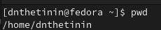
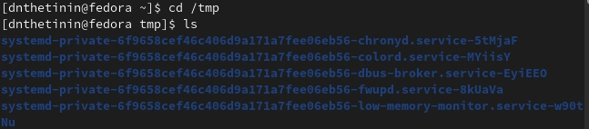
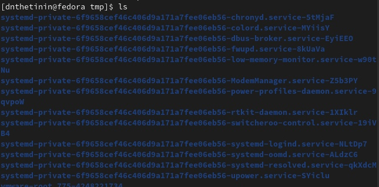
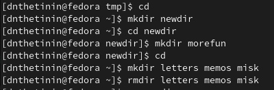
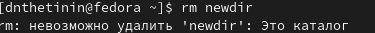
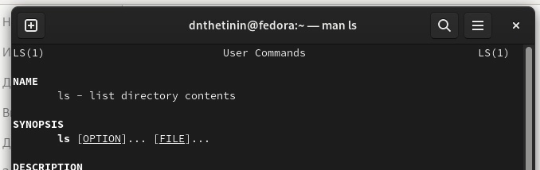

---
## Front matter
lang: ru-RU
title: Лабораторная работа 4 
author:
  - Щетинин Даниил Николаевич
institute:
  - Российский университет дружбы народов, Москва, Россия
 
date: 17.02.2023

## i18n babel
babel-lang: russian
babel-otherlangs: english

## Formatting pdf
toc: false
toc-title: Содержание
slide_level: 2
aspectratio: 169
section-titles: true
theme: metropolis
header-includes:
 - \metroset{progressbar=frametitle,sectionpage=progressbar,numbering=fraction}
 - '\makeatletter'
 - '\beamer@ignorenonframefalse'
 - '\makeatother'
---

# Вводная часть

## Цель работы

Приобретение практических навыков взаимодействия пользователя с системой посредством командной строки.
    

## Задание

Выполнить множество разных команд с целью освоения терминала 

## Шаг 1 

Определим имя домашнего каталога 

{#fig:001 width=70%}

## Шаг 2 

перейдем в каталог /tmp

{#fig:002 width=70%}

## Шаг 3

Определим содержимое каталога /tmp с помощью команды ls. Также рассмотрим работу данной команды с различными опциями. Например, опция -а отображает дополнительно имена скрытых файлов. Опция -l позволяет подробную информацию о сайтах и каталогах

{#fig:003 width=70%}

## Шаг 4 
Создадим в домашнем каталоге новый каталог с именем newdir. В этом новом каталоге создадим каталог morefun. Также одной командой создадим три каталога - letters, memos, misk и удаляем их 

Для того, чтобы вставить картинку, нужно скопировать ее в папку image. 

{#fig:004 width=70%}

Удаляем созданные каталоги с помощью команды rmdir, команда rm не позволяет удалить каталог newdir 

## Шаг 5 

Удаляем созданные каталоги с помощью команды rmdir, команда rm не позволяет удалить каталог newdir 

{#fig:005 width=70%}

## Шаг 6

С помощью команды man ls проверяем функции команды ls, cd, pwd, mkdir, rmdir, rm

(рис. @fig:006).

{#fig:006 width=70%}

## Шаг 7 

Используя информацию, полученную при помощи команды history, исполняем команду из буфера.

{#fig:006 width=70%}

## Конец

Спасибо за внимание! 

