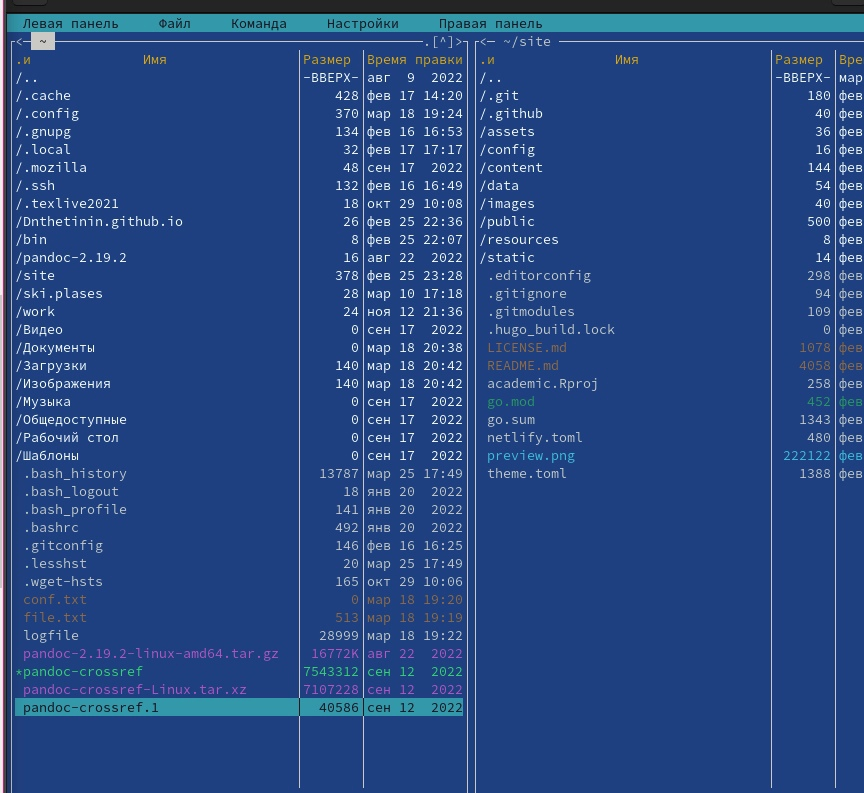
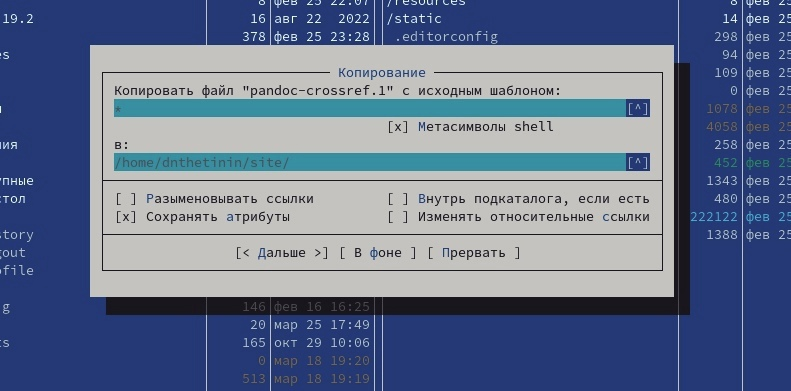
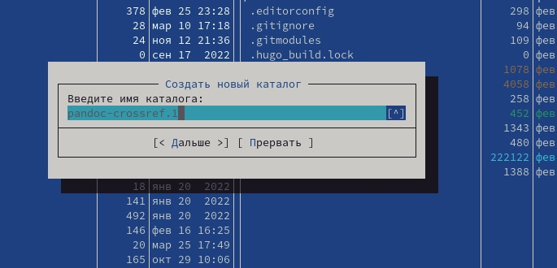
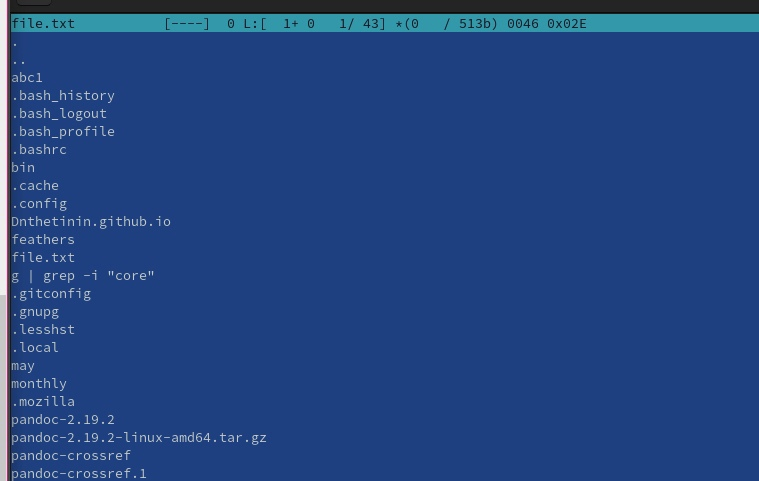
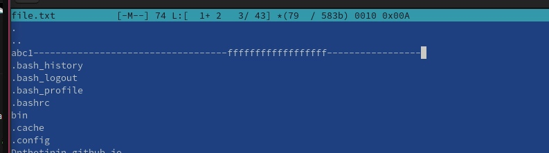
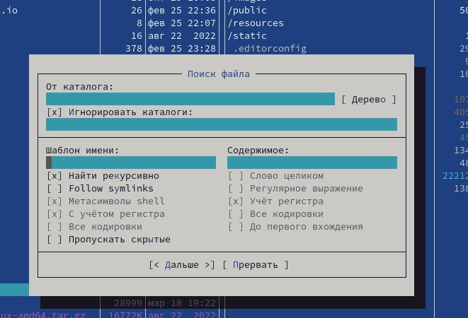
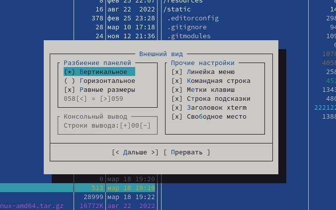
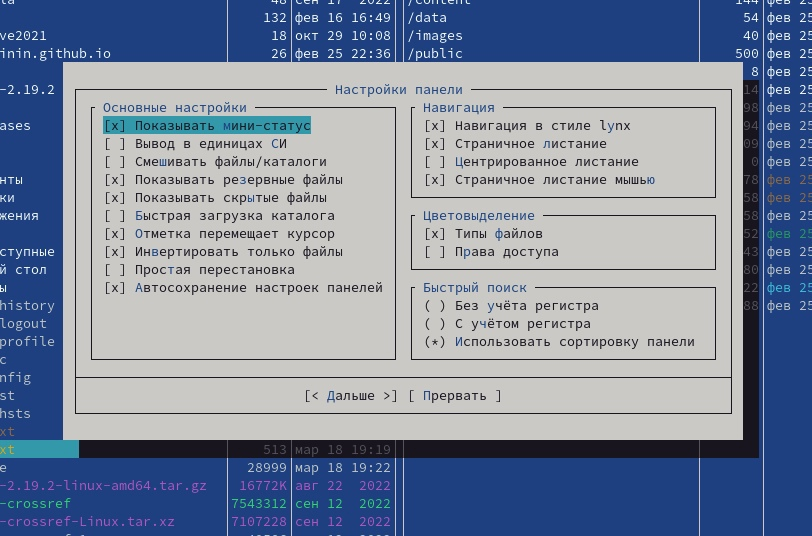
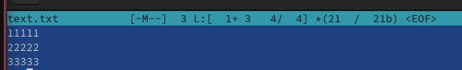
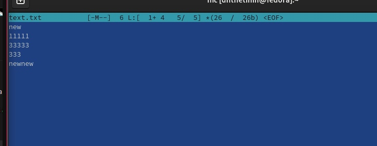

---
## Front matter
title: "Лабораторная работа 7"
author: "Щетинин Даниил Николаевич"

## Generic otions
lang: ru-RU
toc-title: "Содержание"

## Bibliography
bibliography: bib/cite.bib
csl: pandoc/csl/gost-r-7-0-5-2008-numeric.csl

## Pdf output format
toc: true # Table of contents
toc-depth: 2
lof: true # List of figures
lot: true # List of tables
fontsize: 12pt
linestretch: 1.5
papersize: a4
documentclass: scrreprt
## I18n polyglossia
polyglossia-lang:
  name: russian
  options:
	- spelling=modern
	- babelshorthands=true
polyglossia-otherlangs:
  name: english
## I18n babel
babel-lang: russian
babel-otherlangs: english
## Fonts
mainfont: PT Serif
romanfont: PT Serif
sansfont: PT Sans
monofont: PT Mono
mainfontoptions: Ligatures=TeX
romanfontoptions: Ligatures=TeX
sansfontoptions: Ligatures=TeX,Scale=MatchLowercase
monofontoptions: Scale=MatchLowercase,Scale=0.9
## Biblatex
biblatex: true
biblio-style: "gost-numeric"
biblatexoptions:
  - parentracker=true
  - backend=biber
  - hyperref=auto
  - language=auto
  - autolang=other*
  - citestyle=gost-numeric
## Pandoc-crossref LaTeX customization
figureTitle: "Рис."
tableTitle: "Таблица"
listingTitle: "Листинг"
lofTitle: "Список иллюстраций"
lotTitle: "Список таблиц"
lolTitle: "Листинги"
## Misc options
indent: true
header-includes:
  - \usepackage{indentfirst}
  - \usepackage{float} # keep figures where there are in the text
  - \floatplacement{figure}{H} # keep figures where there are in the text
---

# Цель работы

Освоение основных возможностей командной оболочки Midnight Commander. Приоб-
ретение навыков практической работы по просмотру каталогов и файлов; манипуляций
с ними.
    
# Задание

Использовать MC для выполнения базовых функций 
   

# Выполнение лабораторной работы

Внимательно изучаем мануал по команде mc. 

выполняем мс 

Выполняем основные операции в оболочке (копирование файлов и каталогов и переименование файлов):

(рис. @fig:002).

{#fig:002 width=70%}

Копируем файл

(рис. @fig:003).

{#fig:003 width=70%}

Создаем новый каталог 

(рис. @fig:004).

{#fig:004 width=70%}

Просмотрим содержимое текстового файла:

(рис. @fig:005).

{#fig:005 width=70%}

Редактируем содержимое текстового файла:

(рис. @fig:006).

{#fig:006 width=70%}

При помощи меню Команда  ищем  файлы 

(рис. @fig:007).

{#fig:007 width=70%}

Проанализируем файлы меню и расширений:

(рис. @fig:008).

{#fig:008 width=70%}

Освоим основные операции меню Настройки:

(рис. @fig:009).

{#fig:009 width=70%}

Создадим текстовый файл 

Отредактируем его 

(рис. @fig:010).

{#fig:010 width=70%}

используя горячие клавиши, проведем с текстом манипуляции

(рис. @fig:011).

{#fig:011 width=70%}

# Ответы на контрольные вопросы

# Вопросы

 
   
    
# Выводы

я Освоил основные возможности командной оболочки Midnight Commander. Приоб-
рёл навыки практической работы по просмотру каталогов и файлов; манипуляций
с ними.

